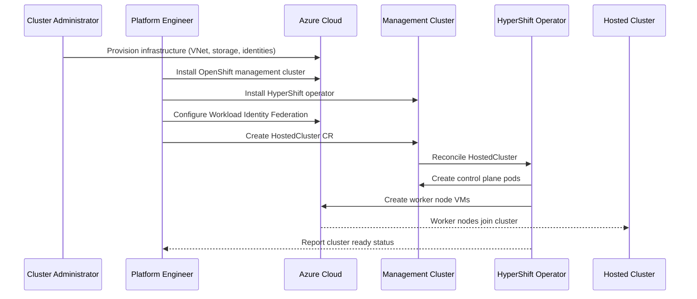

# Self-Managed Azure HyperShift

## Summary

This enhancement proposal defines the design and implementation for self-managed
Azure support in HyperShift. Self-managed Azure enables users to run HyperShift
hosted control planes on self-managed Azure infrastructure outside of the ARO
HCP (Azure Red Hat OpenShift Hosted Control Planes) managed service. Unlike the
managed offering where infrastructure is provisioned and managed by the service,
self-managed Azure requires users to provision their own Azure resources such as
Virtual Networks, storage accounts, managed identities, and DNS zones, while
managing the HyperShift operator lifecycle themselves.

## Motivation

Currently, HyperShift on Azure is primarily available through ARO HCP, a managed
service offering. However, there is significant demand from users who need to
run HyperShift on Azure with more control over their infrastructure and without
the constraints of a managed service. Self-managed Azure HyperShift addresses
this need by allowing users to deploy OpenShift hosted control planes on
customer-provisioned OpenShift management clusters running in Azure.

This approach provides several benefits:
- Users retain full control over their Azure infrastructure and management
  cluster lifecycle
- Enables deployment in environments where managed services are not permitted
- Allows customization of infrastructure to meet specific organizational
  requirements
- Provides flexibility in network architecture and security configurations

### User Stories

#### Story 1: Platform Engineer Deploying Hosted Clusters

As a platform engineer, I want to deploy HyperShift hosted control planes on my
existing Azure OpenShift management cluster so that I can provide on-demand
OpenShift clusters to my development teams while maintaining control over the
underlying infrastructure.

#### Story 2: Cluster Administrator Managing Infrastructure

As a cluster administrator, I want to provision and manage the Azure
infrastructure required for HyperShift (VNets, storage, managed identities) so
that I can ensure compliance with my organization's security and networking
policies.

#### Story 3: Operations Team Monitoring Deployments

As an operations team member, I want to monitor the health and status of
self-managed Azure HyperShift deployments using standard HyperShift metrics so
that I can proactively identify and remediate issues at scale.

#### Story 4: Security Engineer Configuring Workload Identity

As a security engineer, I want to configure Azure Workload Identity Federation
for hosted clusters so that OpenShift components can authenticate to Azure
services using short-lived tokens without managing long-lived credentials.

### Goals

1. Enable deployment of HyperShift hosted control planes on self-managed Azure
   infrastructure using customer-provisioned OpenShift management clusters.

2. Provide clear documentation and tooling for Azure infrastructure prerequisites
   including VNets, subnets, storage accounts, managed identities, and DNS zones.

3. Support Azure Workload Identity Federation for secure authentication of
   OpenShift components to Azure services.

4. Ensure self-managed Azure HyperShift follows the same operational patterns as
   other supported HyperShift platforms (AWS, bare metal).

5. Deliver the feature as Developer Preview in OpenShift 4.21 with a clear path
   to Tech Preview and GA.

### Non-Goals

1. This proposal does not aim to replace or deprecate the ARO HCP managed
   service offering.

2. Providing automated infrastructure provisioning equivalent to the managed
   service is not in scope for the initial implementation.

3. Supporting Azure Stack Hub or Azure Government environments is not in the
   initial scope (may be addressed in future enhancements).

## Proposal

Self-managed Azure HyperShift extends the existing HyperShift architecture to
support Azure as a platform where users manage all infrastructure themselves.
The implementation leverages existing HyperShift patterns while adding
Azure-specific infrastructure provisioning guidance and workload identity
integration.

The deployment consists of three main phases:

1. **Azure Workload Identity Setup**: Create managed identities for OpenShift
   components, configure the OIDC issuer, and establish federated credentials.

2. **Management Cluster Setup**: Install the HyperShift operator on an existing
   OpenShift cluster in Azure, optionally configure External DNS, and prepare
   the cluster to host control planes.

3. **Hosted Cluster Creation**: Provision Azure infrastructure for the hosted
   cluster, deploy the control plane, create worker node VMs, and integrate
   workload identities.

### Workflow Description

**Platform Engineer** is a human user responsible for setting up the management
cluster and deploying hosted clusters.

**Cluster Administrator** is a human user responsible for provisioning and
maintaining Azure infrastructure.

**HyperShift Operator** is the software component that manages hosted cluster
lifecycles.

1. The cluster administrator provisions the required Azure infrastructure:
   - Creates a resource group for persistent shared resources
   - Creates Virtual Network (VNet) with appropriate subnets
   - Configures Network Security Groups (NSGs)
   - Sets up Azure DNS zones
   - Creates storage accounts for OIDC and image registry
   - Creates managed identities for OpenShift components

2. The platform engineer installs the OpenShift management cluster on Azure
   using the standard OpenShift installer.

3. The platform engineer installs the HyperShift operator on the management
   cluster following the
   [Setup Azure Management Cluster](https://hypershift.pages.dev/how-to/azure/setup-management-cluster/)
   documentation. With External DNS (recommended for production):
   ```bash
   hypershift install \
     --external-dns-provider=azure \
     --external-dns-credentials $SERVICE_PRINCIPAL_FILEPATH \
     --pull-secret $PULL_SECRET \
     --external-dns-domain-filter $DNS_ZONE_NAME \
     --limit-crd-install Azure
   ```
   Or without External DNS (simpler, for development):
   ```bash
   hypershift install \
     --pull-secret $PULL_SECRET \
     --limit-crd-install Azure
   ```

4. The platform engineer configures Azure Workload Identity Federation:
   - Creates federated credentials linking Kubernetes service accounts to
     Azure managed identities
   - Configures the OIDC issuer endpoint

5. The platform engineer creates a hosted cluster using the HyperShift CLI
   following the
   [Create a Self-Managed Azure HostedCluster](https://hypershift.pages.dev/how-to/azure/create-self-managed-azure-cluster/)
   documentation:
   ```bash
   hypershift create cluster azure \
     --name $CLUSTER_NAME \
     --namespace $CLUSTER_NAMESPACE \
     --azure-creds $AZURE_CREDS \
     --location $LOCATION \
     --node-pool-replicas 2 \
     --base-domain $PARENT_DNS_ZONE \
     --pull-secret $PULL_SECRET \
     --generate-ssh \
     --release-image $RELEASE_IMAGE \
     --external-dns-domain $DNS_ZONE_NAME \
     --resource-group-name $MANAGED_RG_NAME \
     --vnet-id $VNET_ID \
     --subnet-id $SUBNET_ID \
     --network-security-group-id $NSG_ID \
     --sa-token-issuer-private-key-path $SA_TOKEN_ISSUER_PRIVATE_KEY_PATH \
     --oidc-issuer-url $OIDC_ISSUER_URL \
     --dns-zone-rg-name $PERSISTENT_RG_NAME \
     --assign-service-principal-roles \
     --workload-identities-file ./workload-identities.json \
     --diagnostics-storage-account-type Managed
   ```

6. The HyperShift operator provisions the hosted control plane in the management
   cluster namespace.

7. The HyperShift operator creates worker node VMs in Azure using the configured
   infrastructure.

8. The platform engineer monitors the hosted cluster status and manages ongoing
   operations using standard HyperShift tooling.



### API Extensions

<!-- TODO: This section needs to be updated when Tech Preview API changes are
finalized. Currently, for Dev Preview, no new API fields are required. However,
Tech Preview may introduce new fields on HostedCluster and/or NodePool for
Azure-specific configuration. When API changes are needed, update this section
and change api-approvers from "None" to "TBD", then request an API reviewer
from the #forum-api-review Slack channel. -->

For the initial Dev Preview implementation, no API extensions are required.
Self-managed Azure leverages the existing HostedCluster and NodePool APIs with
Azure platform configuration.

### Topology Considerations

#### Hypershift / Hosted Control Planes

This enhancement is specifically designed for HyperShift/Hosted Control Planes.
The proposal defines how self-managed Azure deployments differ from the managed
ARO HCP offering:

- **Management Cluster**: Must be a customer-provisioned OpenShift cluster
  running in Azure (unlike ARO HCP which uses an AKS management cluster)
- **Infrastructure Lifecycle**: Users are responsible for provisioning and
  maintaining all Azure infrastructure
- **Workload Identity**: Users must configure Azure Workload Identity Federation
  manually
- **DNS**: Users can optionally configure External DNS for automatic DNS record
  management or manage DNS manually

The hosted control plane runs as pods in the management cluster, while worker
nodes are Azure VMs in the customer's subscription.

#### Standalone Clusters

This proposal does not apply to standalone OpenShift clusters. Self-managed
Azure HyperShift is specifically for the hosted control plane topology.

#### Single-node Deployments or MicroShift

This proposal does not apply to Single-node OpenShift (SNO) or MicroShift
deployments. While SNO could theoretically serve as a management cluster for
HyperShift, this is not a target use case for self-managed Azure.

### Implementation Details/Notes/Constraints

The implementation builds on the existing HyperShift Azure support used by ARO
HCP, adapting it for self-managed deployments. Key implementation areas include:

1. **Infrastructure Documentation**: Comprehensive documentation for Azure
   infrastructure prerequisites is being developed in
   https://github.com/openshift/hypershift/pull/7361.

2. **HyperShift CLI Enhancements**: The `hypershift create cluster azure`
   command supports self-managed deployments with user-provided infrastructure
   parameters.

3. **Workload Identity Integration**: Azure Workload Identity Federation is used
   for secure authentication, requiring:
   - OIDC issuer configuration
   - Managed identities for each OpenShift component
   - Federated credentials linking Kubernetes service accounts

4. **Resource Group Strategy**:
   - Persistent resource group for shared resources (OIDC storage, DNS zones)
   - Cluster-specific resource groups for hosted cluster infrastructure

5. **Network Configuration**:
   - User-provided VNet and subnets
   - Network Security Groups for security policies
   - Load balancers for API and ingress endpoints

<!-- Note: Per dev-guide/feature-zero-to-hero.md, new features typically require
a feature gate. However, since this enhancement extends existing supported
functionality and does not introduce breaking changes, a feature gate may not
be required. Verify with the API review team if a feature gate is needed. -->

### Risks and Mitigations

**Risk**: Users may misconfigure Azure infrastructure leading to deployment
failures.

**Mitigation**: Provide comprehensive documentation, validation in the
HyperShift CLI, and clear error messages when infrastructure prerequisites are
not met.

---

**Risk**: Azure API rate limiting may impact large-scale deployments.

**Mitigation**: Implement appropriate retry logic and backoff in Azure API
clients. Document recommended practices for scaling.

---

**Risk**: Security vulnerabilities from misconfigured workload identity.

**Mitigation**: Provide detailed security guidance and validation of workload
identity configuration. Use least privilege principles in documentation
examples.

### Drawbacks

1. **Operational Complexity**: Self-managed Azure requires users to manage both
   the management cluster and Azure infrastructure, increasing operational
   burden compared to ARO HCP.

2. **Support Scope**: Support for self-managed deployments may be more complex
   as infrastructure varies between customers.

3. **Feature Parity**: Some features available in ARO HCP may not be immediately
   available or require additional configuration in self-managed deployments.

## Open Questions [optional]

This section is intentionally left empty. No open questions remain at this time.

## Test Plan

<!-- TODO: Develop comprehensive test plan per dev-guide/feature-zero-to-hero.md
requirements. Tests must include:
- `[OCPFeatureGate:SelfManagedAzure]` label (if feature gate is used)
- `[Jira:"HyperShift"]` label for component
- Appropriate test type labels (`[Suite:...]`, `[Serial]`, `[Slow]`, etc.)

Reference dev-guide/test-conventions.md for labeling requirements.

Test coverage should include:
- End-to-end hosted cluster lifecycle (create, upgrade, delete)
- Worker node provisioning and scaling
- Workload identity authentication
- Network connectivity validation
- Upgrade and downgrade scenarios
-->

The test strategy for self-managed Azure HyperShift includes:

1. **Unit Tests**: Test Azure-specific logic in HyperShift controllers and CLI.

2. **End-to-End Tests**: Full hosted cluster lifecycle tests including creation,
   scaling, upgrades, and deletion on Azure infrastructure.

3. **Conformance Tests**: Run OpenShift conformance test suite on hosted
   clusters deployed via self-managed Azure.

## Graduation Criteria

<!-- TODO: Define specific graduation criteria per dev-guide/feature-zero-to-hero.md
promotion requirements:
- Minimum 5 tests per feature
- All tests run at least 7 times per week
- All tests run at least 14 times per supported platform
- 95% pass rate
- Tests running on all supported platforms

See the feature-zero-to-hero.md document for complete requirements. -->

### Dev Preview -> Tech Preview

Tracked by [OCPSTRAT-2252](https://issues.redhat.com/browse/OCPSTRAT-2252).

- Ability to deploy and manage hosted clusters end-to-end on self-managed Azure
- Documentation for all Azure infrastructure prerequisites
- Basic test coverage for cluster lifecycle operations
- Gather feedback from early adopters

### Tech Preview -> GA

Tracked by [OCPSTRAT-2253](https://issues.redhat.com/browse/OCPSTRAT-2253).

- Comprehensive test coverage across supported configurations
- Performance and scale testing completed
- User-facing documentation in openshift-docs
- Support procedures documented
- At least one minor release cycle of Tech Preview feedback addressed

### Removing a deprecated feature

N/A - This is a new feature.

## Upgrade / Downgrade Strategy

Self-managed Azure HyperShift follows the standard HyperShift upgrade path with
no Azure-specific considerations:

**Upgrade**:
- Management cluster upgrades follow standard OpenShift upgrade procedures
- HyperShift operator upgrades are handled by OLM
- Hosted cluster upgrades are controlled via the HostedCluster release image

**Downgrade**:
- Management cluster downgrades are not supported (standard OpenShift policy)
- HyperShift operator downgrades should be avoided; if necessary, ensure
  compatible hosted cluster versions
- Hosted cluster downgrades are controlled via the HostedCluster release image
  (subject to standard OpenShift downgrade policies)

No special handling is required for Azure infrastructure during upgrades.

## Version Skew Strategy

Self-managed Azure HyperShift follows the standard HyperShift
[Versioning and Support](https://hypershift.pages.dev/reference/versioning-support/)
policy:

- **NodePool to HostedCluster**: NodePool version cannot be higher than the
  HostedCluster version. NodePools support up to N-3 version skew (up to 3
  minor versions behind the HostedCluster).
- **Hosted Cluster versions**: Supported versions are determined by the
  HyperShift Operator and listed in the `supported-versions` ConfigMap.
  Typically supports the same OCP version as the management cluster plus two
  previous minor versions.
- **Management Cluster**: For production deployments, use Multi-Cluster Engine
  (MCE) which has specific OCP management cluster version requirements.
- Azure infrastructure components are version-agnostic and do not require
  version coordination.

Monitor the `SupportedVersionSkew` condition on NodePools to identify version
compatibility issues.

## Operational Aspects of API Extensions

N/A - No API extensions are introduced in this enhancement.

## Support Procedures

### Detecting Issues

1. **HostedCluster not becoming available**:
   - Check HostedCluster conditions: `oc get hostedcluster -o yaml`
   - Review HyperShift operator logs: `oc logs -n hypershift deployment/operator`
   - Verify Azure infrastructure is correctly provisioned

2. **Worker nodes not joining**:
   - Check NodePool conditions: `oc get nodepool -o yaml`
   - Verify Azure VM provisioning in Azure portal
   - Check Network Security Group rules allow required traffic

3. **Workload Identity authentication failures**:
   - Verify managed identity configuration in Azure
   - Check federated credential configuration
   - Review component logs for authentication errors

### Common Remediation Steps

1. **Infrastructure issues**: Verify Azure resources match documented
   prerequisites. Check VNet connectivity, NSG rules, and DNS configuration.

2. **Authentication issues**: Regenerate federated credentials and restart
   affected pods to pick up new tokens.

3. **Scaling issues**: Check Azure subscription quotas and resource limits.

## Infrastructure Needed [optional]

- Azure subscription for CI/CD testing with appropriate quotas
- Test Azure infrastructure (VNets, storage accounts, DNS zones) for e2e tests
- Integration with existing HyperShift CI infrastructure
